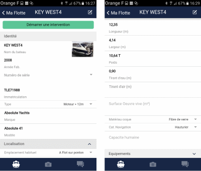

# Boat Details

If you click on a boat in the list, the detailed technical sheet is displayed. In this sheet, you can find all information regarding:

- Its identity
- Its usual location
- Its dimensions and weight
- The description of its engines
- The equipment on board

In the "Documents" section, you can also store technical sheets and invoices for the boat and equipment, to make them available at any time.

## Sharing with Your Clients

This information is shared with your client so that they have useful information for maintaining their boat at all times.

## Possible Actions

- **Edit information**: edit icon at the top right
- **Start an intervention**: dedicated button
