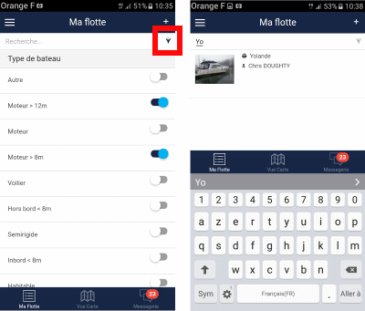

# Boat Search

Two filtering methods are available to easily find a boat in your fleet.

## Filters by Boat Type

In the boat's technical sheet, a filter field allows you to classify boats according to their main typology: sailboat, outboard, semi-rigid, inboard, habitable...

These filters are available from the small funnel icon located at the top right of the screen. The list of boats is automatically filtered in this screen. To hide the filters, press the funnel icon again.

## Search Area

You can also search for a boat by the following fields:

- Make
- Model
- Registration
- Boat Name
- Client Name
