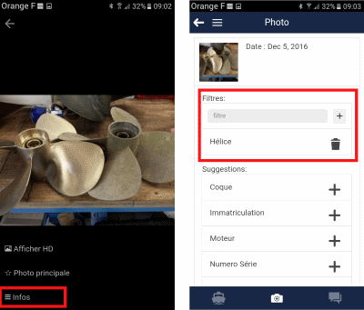

# Photo Editing

If you click on a photo, it appears in full screen. You can then scroll through the previous and next photos by swiping your finger on the screen. You can also zoom in on the photo using the classic 2-finger gesture.

## Action Menu

By clicking on the photo, a menu appears with the following options:

- **View photo in HD** (High Definition)
- **Set as main photo**
- **Info** (editing screen)

## Property Editing

Photo editing allows you to see the date it was taken and edit the Tags. Tags define the photo classification.

Default tags and frequently used tags are suggested to you. Click on the small **+** in the suggestions to classify the photo. It is also possible to add your own tags: enter text in the area labeled "filter" and press the **+**.

It is possible to delete tags assigned to the photo using the trash can icon next to the tag.
