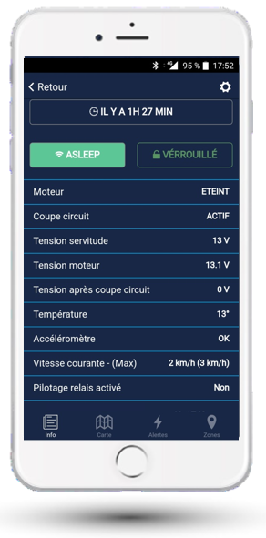

# View the Latest Information from Your Boat

The screen shows the last status of the module received (for example 1H27 min ago).

## Transmission Frequency

- **Standby**: the module sends a status every 2 hours
- **In case of alert**: a message is sent instantly, then every 10 minutes
- **Engine running**: a status is sent every 10 minutes

## Consultation

The screen presents the last known state on the boat. To access the history of a sensor, click on it and the history graph appears.

Navigate to previous and following periods using the arrows, or directly select the desired period by day, week, or month.
