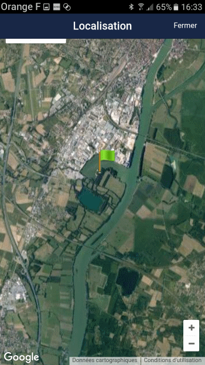

# Location

Location information includes the usual position accessible in the technical sheet. With a surveillance module, real-time location is available.

> **Note:** It is possible to correct GPS inaccuracies by moving the flag on the map.
