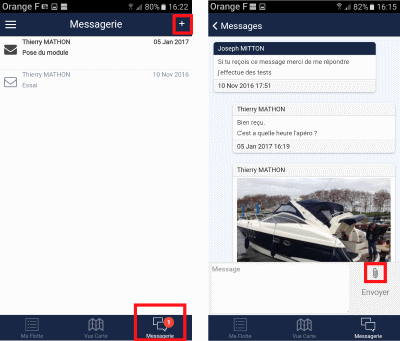

# Messaging

Messaging is a tool embedded in the NAUTICONCEPT application to keep track of your discussions with your dealer.

It is a discussion thread to ask questions, notify of visits, share maintenance information.

## Access

Accessible via the Burger menu or the home page.

## Visual Indicators

- Unread messages indicated in red
- Black envelopes for unread messages
- White envelopes for read messages

## Create a Message

Click on the **+** button to create a new message.

## Attachments

You can attach photos via the paperclip to support your explanations.
