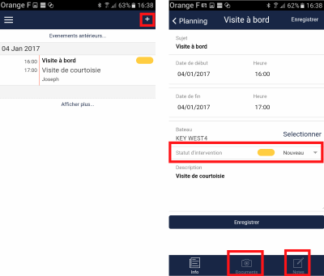

# My Schedule

From the Burger menu, "My Schedule" displays the complete history of interventions. You can add your own interventions (cleaning, GPS change, etc.).

## Intervention Content

Each intervention contains:

- A subject
- A start date/time and end date/time
- A description
- A status

## Intervention Statuses

- **New**: intervention requested but not planned
- **Validated**: validated by the boat owner
- **Planned**: planned by the dealer
- **In Progress**: intervention started
- **Closed**: intervention finished
- **Cancelled**

## Documentation

View photos and mechanic notes for each intervention.
