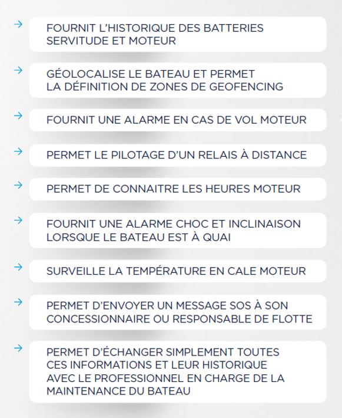
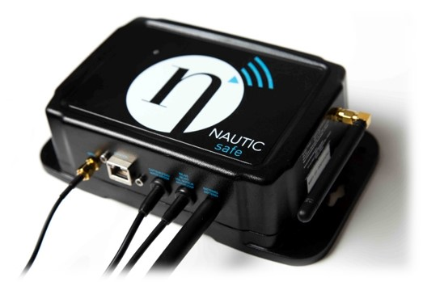

# NauticSafe Module

The NauticSafe module allows remote supervision of your boat.

To access the complete NauticSafe module documentation, consult the [NauticSafe documentation](../nauticsafe/index.md).
