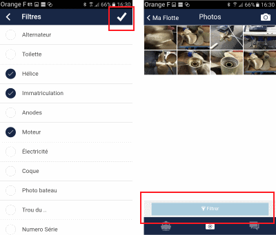

# Photo Organization

Photos are classified according to tags that describe them best.

The "Filter" button allows you to quickly find photos by subject (for example the engine). These tags can be combined: it is possible to classify a photo in both "Engine" and "Serial Numbers".
