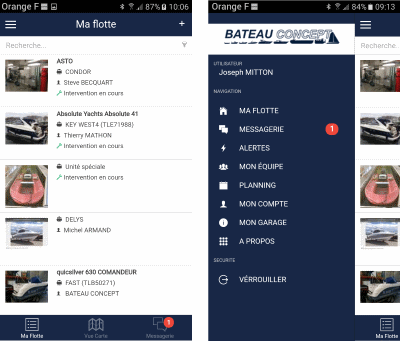

# Accueil et Menu

La page d'accueil présente « Ma flotte » : la liste des bateaux dont vous disposez en entretien. Le bateau est présenté par une photo principale, la marque et le modèle, son nom et son immatriculation. Le nom du client apparait également pour faciliter la recherche.

En bas d'écran, des onglets permettent d'accéder à :

- Géolocalisation de la flotte
- Messagerie

## Menu Burger

En cliquant sur l'icône à 3 traits (menu burger), vous accédez aux fonctionnalités suivantes :

- **Ma flotte** : page d'accueil
- **Messagerie interne**
- **Alertes** : modules NauticSafe
- **Mon équipe** : gestion des mécaniciens
- **Planning** : gestion des interventions
- **Mon Compte** : informations personnelles
- **Mon garage** : informations de la concession
- **A propos** : version de l'application
- **Verrouiller** : fermeture de session
