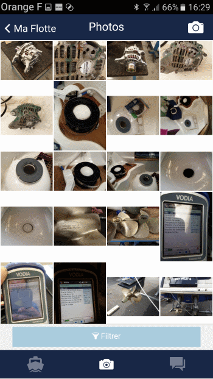

# Gestion des photos

NAUTICONCEPT est un outil qui favorise la communication entre tous les intervenants sur un bateau en utilisant la photo comme support central. L'onglet photo permet de voir et partager des photos de votre bateau et de tous ses composants mécaniques et d'équipement.
