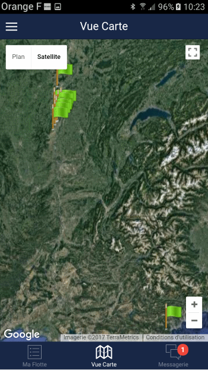

# Localisation

La vue carte représente sur la carte l'ensemble des bateaux dont vous avez renseigné la localisation habituelle. Si vous disposez du module de surveillance NauticSafe, la localisation temps réel du bateau sera présentée.

## Indicateurs visuels

Les bateaux pour lesquels des travaux sont en cours apparaissent avec un drapeau orange. En cliquant sur un drapeau de la carte, les informations sur le bateau apparaissent et vous pouvez accéder à la fiche du bateau.

> **Note :** Quand vous éditez la position habituelle du bateau, il est possible de déplacer le drapeau sur la carte afin de corriger les imprécisions du système GPS.
