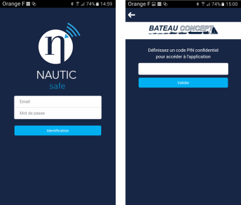

# Connexion

Après avoir lancé l'application, l'écran d'accueil vous demande de saisir votre adresse email et le mot de passe que vous avez reçus. Après les avoir saisis, cliquez sur identification.

L'écran suivant vous propose de choisir un code PIN à quatre chiffres pour un accès ultérieur rapide. La prochaine fois que vous l'utiliserez, seul le code PIN sera nécessaire.
