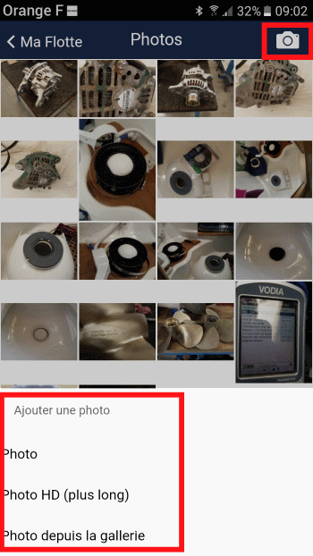

# Prendre une photo

Cliquez sur l'icône appareil photo pour accéder à trois options :

## Photo

Compression environ 50%, optimisée pour internet, accès rapide. Adaptée aux vues d'ensemble.

## Photo HD

Résolution maximale du téléphone, chargement plus long, détail excellent. Idéale pour numéros de série et documents.

## Photo depuis galerie

Importe une photo existante du smartphone ou tablette.

> Après importation, accédez aux propriétés pour effectuer la classification par tags.
