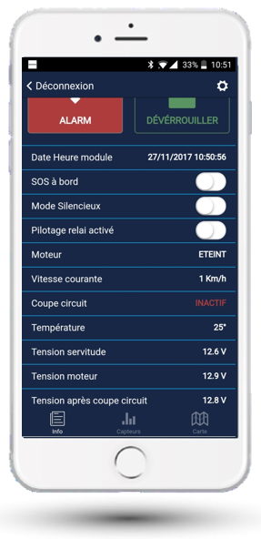

# À bord de mon bateau

Signalez votre présence à bord et visualisez les capteurs.

Le statut du module est indiqué en haut à gauche (par exemple ALARM).

## Déverrouiller les capteurs

Cliquez sur « Déverrouiller » pour désactiver les capteurs choc et gîte de votre bateau. Ces capteurs, actifs lorsque l'on est au ponton, permettent de savoir si le bateau « tape » le ponton ou si quelqu'un monte à bord (pour les petites unités).

## Données en temps réel

Cet écran montre en temps réel les données des capteurs :

- Température
- Présence d'eau
- Tensions servitude
- Moteur
- Après coupe-circuit
- Vitesse GPS

Les alertes apparaissent en rouge (par exemple coupe-circuit désactivé).
