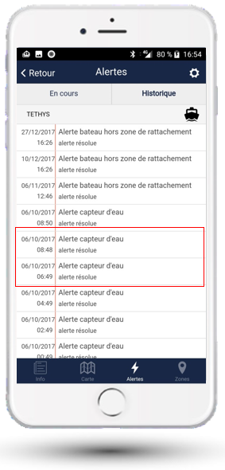
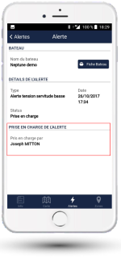

# Historique des alertes

Le 3ème onglet présente les alarmes actives et l'historique des alarmes sur le bateau.

En cliquant sur une alarme, vous pouvez accéder au détail. Votre concessionnaire peut ici vous signaler qu'il a pris en charge l'alerte. Elle sera « fermée » quand la situation sera revenue à la normale.

