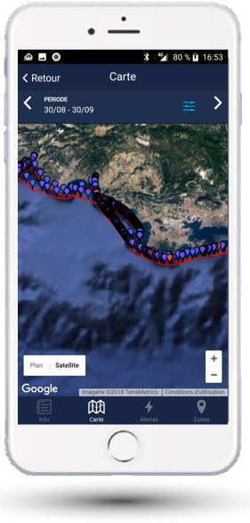

# Historique de géolocalisation

L'onglet Carte permet de voir l'historique de position de votre bateau.

NauticSafe utilise le système américain GPS pour se localiser. La précision est de +/- 10 mètres, tout particulièrement quand le bateau n'est pas en mouvement. La précision peut être affaiblie si le bateau est stocké à l'intérieur d'un bâtiment, ou s'il est en métal.

## Utilisation

- Sélectionnez la période souhaitée
- Zoomez pour en découvrir le détail
- La couleur des points représente le statut du module (rouge = ALARM)
- Cliquez sur un point pour connaître le statut précis, l'alarme éventuelle, et l'heure précise
