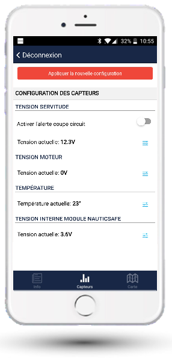

# Configurer les seuils d'alarme

Dans l'onglet Capteurs, configurez les alertes du module :

- **Tension Servitude** : un niveau Alerte et un niveau Alarme
- **Tension Moteur** : un niveau Alerte et un niveau Alarme
- **Température** : un niveau d'alerte bas, et un niveau d'alerte haut
- **Tension interne** : le module est muni d'une batterie interne qui lui permet de continuer à fonctionner quelques jours s'il n'est plus alimenté. Laissez cette valeur à 2,8V

> N'oubliez pas de cliquer sur le bouton « Enregistrer » en haut à droite.
