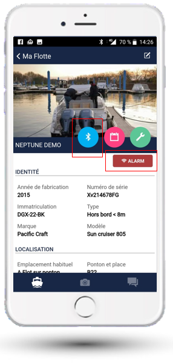

# La supervision de votre bateau depuis votre smartphone

Le module NauticSafe supervise les organes vitaux à bord pour prévenir les avaries et anticiper les maintenances, grâce aux alertes et historiques.

NauticSafe offre un oeil permanent sur votre bateau, loué ou prêté. Il minimise les risques, les mauvaises surprises et sécurise ainsi votre investissement.

## Connexion

- **À bord** : connectez-vous grâce au bouton Bluetooth
- **À distance** : récupérez le dernier état enregistré et les historiques en cliquant sur le bouton d'état

## Statuts disponibles

- **ASLEEP** : en veille
- **RUN** : moteur en route
- **ALARM** : en alarme
- **ONBOARD** : quelqu'un est à bord
