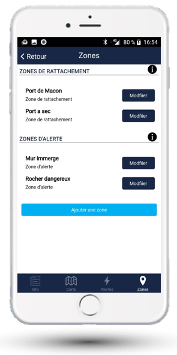
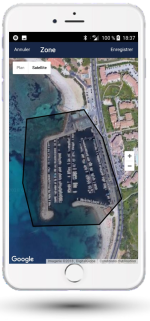

# Zones d'alerte et de rattachement

Le dernier onglet présente la gestion des zones :

- **Zones de rattachement** : zones géographiques dans lesquelles le bateau doit se situer quand vous n'êtes pas à bord
- **Zones d'alerte** : zones pour lesquelles une alerte doit être déclenchée si le bateau les pénètre

## Définir une zone

Définissez les zones en leur donnant :

- Un nom
- Un type (zone de rattachement ou zone d'alerte)
- La série de points délimitant la zone
